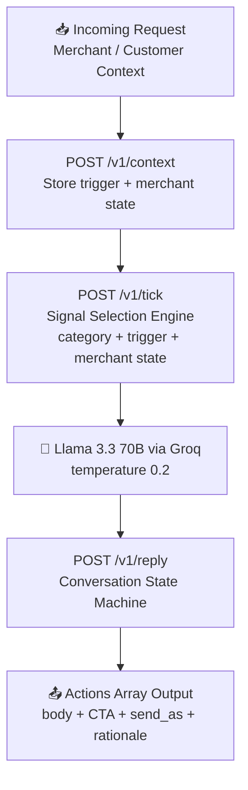

# 🤖 Vera Message Engine v3.0

> Signal-first AI message composer built for **magicpin's Vera AI Challenge**

[](https://fastapi.tiangolo.com)
[](https://groq.com)
[](https://python.org)
[](https://vera-bot-adqs.onrender.com)

**🌐 Live Demo:** https://vera-bot-adqs.onrender.com

---

## 🧠 What it does

Vera is magicpin's AI assistant for merchant growth. This bot powers the **message engine** behind Vera — deciding what to say, when to say it, and how to say it for each merchant.

---

## 🏗️ System Architecture



## ✨ Key Features

- 🎯 **Signal-first composition** — picks ONE best signal, not every fact
- 🏪 **5 category voice profiles** — Dentists, Salons, Restaurants, Gyms, Pharmacies
- 🔄 **Conversation state machine** — auto-reply detection, hostile/opt-out handling
- 📊 **Percentage auto-fix** — delta_pct -0.50 correctly reads as -50% drop
- 💬 **Separate prompt scopes** — merchant tone vs customer tone handled differently
- ✅ **Always non-empty body** — every reply path has a meaningful fallback

---

## 🎯 Category Voice Profiles

| Category | Tone | Key Vocabulary |
|---|---|---|
| 🦷 Dentists | peer_clinical | recall, fluoride, caries, high-risk cohort |
| 💇 Salons | warm aspirational | bridal, keratin, skin-prep, combo |
| 🍽️ Restaurants | energetic local | covers, AOV, BOGO, happy hour |
| 🏋️ Gyms | coach to operator | members, conversion, retention, HIIT |
| 💊 Pharmacies | trustworthy precise | chronic-Rx, compliance, home delivery |

---

## 🔄 Conversation State Machine
User Reply

│

├── Auto-reply detected?

│       ├── 1st time → Warn

│       ├── 2nd time → Wait 24h

│       └── 3rd time → End conversation

│

├── Hostile / Opt-out?

│       └── Graceful exit with suppression

│

└── Intent = Yes/Sure/OK?

└── Switch to action mode

with specific deliverable

---

## 🔌 API Endpoints

| Method | Path | Purpose |
|---|---|---|
| GET | `/v1/healthz` | Health check + contexts loaded count |
| GET | `/v1/metadata` | Team info, model, approach |
| POST | `/v1/context` | Store context (idempotent by version) |
| POST | `/v1/tick` | Generate actions from available_triggers |
| POST | `/v1/reply` | Handle merchant/customer replies |

---

## 🛠️ Tech Stack

| Tool | Purpose |
|---|---|
| FastAPI | Backend API framework |
| Llama 3.3 70B | LLM via Groq |
| Groq | Fast LLM inference |
| Render | Cloud deployment |
| Python | Core language |

---

## 🚀 Run Locally

```bash
# 1. Install dependencies
pip install -r requirements.txt

# 2. Set your Groq API key
export GROQ_API_KEY=your_key_here

# 3. Start the server
uvicorn main:app --reload
```

Test at: http://localhost:8000/docs

---

## 🌐 Deployment

Hosted on **Render**
- Environment variable `GROQ_API_KEY` set in dashboard
- Live URL: https://vera-bot-adqs.onrender.com

---

## 👩‍💻 Built by

**Harshinee Venkatasubramaniyan** — GSSoC '26 Contributor | CS Engineering Student
[](https://www.linkedin.com/in/harshinee-venkatasubramaniyan-8353b7379)
